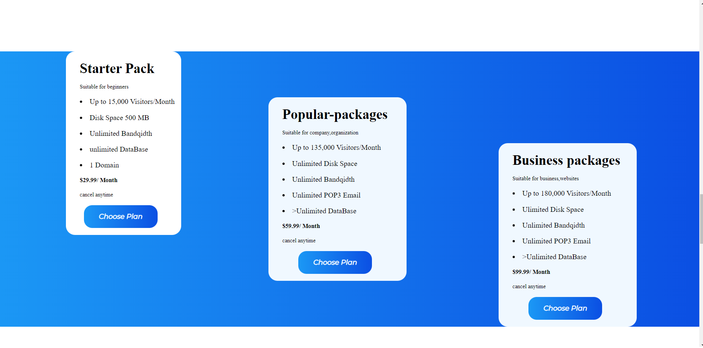

# Hosting Landing Page

11th HTML+CSS project. 

A Hosting Landing Page.

Definitely a challening one,this took time.

Ended up this project with some weird class names. Will surely improve naming convention in my upcoming projects.

I am Happy with the output :)

  

## Screenshots

> Website is only Desktop screen compatible. 